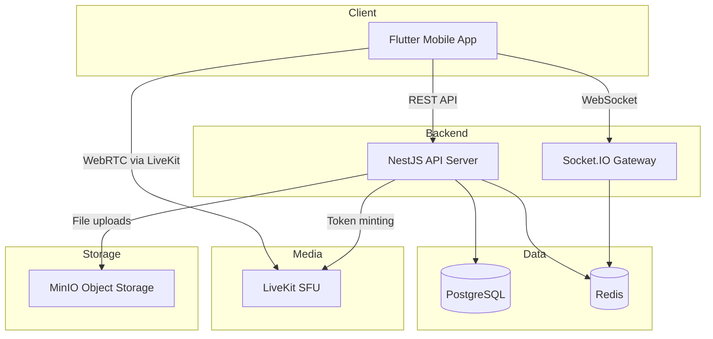

# Architecture

## Component Diagram

## Component Responsibilities

### NestJS Backend API
- RESTful API for all CRUD operations
- JWT authentication and authorization (planned)
- Business logic orchestration
- LiveKit token generation for voice rooms
- File upload handling via MinIO
- Configuration management via environment variables

### PostgreSQL
- Primary persistent data store
- User accounts, teams, tasks, announcements, meetings
- Referential integrity and ACID guarantees
- Schema managed via TypeORM migrations

### Redis
- **Presence state**: Tracks which users are online and their current status (available, in a call, in a meeting). Redis Pub/Sub enables broadcasting presence changes to all connected clients instantly without polling the database.
- **Session/cache**: Stores refresh tokens, rate-limiting counters, and frequently accessed read-heavy data.
- **Pub/Sub backbone**: Socket.IO instances can broadcast events across multiple server replicas via Redis adapters.

### Socket.IO / WebSockets
- Real-time event delivery (presence updates, announcements, task status changes)
- Room-based communication for meeting channels
- Automatic reconnection and fallback to long-polling

### LiveKit (Self-hosted WebRTC SFU)
- Voice and video communication for team meetings
- Screen sharing support
- Simulcast for bandwidth optimization
- Recording capability (future)

### Flutter Mobile App
- Cross-platform client (Android, iOS, Web)
- Feature-first architecture for maintainability
- Flame engine for the interactive virtual office map (planned)
- Socket.IO client for real-time updates
- LiveKit Flutter SDK for voice/video

### MinIO (Optional)
- S3-compatible object storage
- User avatars, shared documents, meeting recordings
- Self-hosted, no cloud dependency

## Why Redis for Presence

Presence tracking requires extremely fast reads and writes with automatic expiration. When a user connects, their presence is set; when they disconnect, it must be cleared immediately. Redis provides:

- **Sub-millisecond latency** for GET/SET operations
- **TTL (Time-To-Live)**: Presence entries auto-expire if a user's heartbeat stops, preventing stale "online" statuses
- **Pub/Sub**: When a user's status changes, Redis publishes the event to all subscribers instantly, allowing the Socket.IO gateway to broadcast to connected clients without database queries
- **Atomic operations**: `SETEX` and `INCR` ensure race conditions are avoided when multiple server instances handle the same user

PostgreSQL would be too slow for this use case because every presence check would require a disk-based query, and cleanup of stale sessions would need a polling mechanism instead of automatic TTL expiry.

## Why LiveKit Instead of Peer-to-Peer Mesh

For a team of ~200 users who may join group calls with 5-20 participants, peer-to-peer mesh is impractical:

- **Bandwidth**: In a call with N participants, each client must upload/download N-1 streams. With 10 participants, that is 9 simultaneous video streams per user. This quickly saturates mobile connections.
- **CPU**: Encoding/decoding multiple streams simultaneously drains battery and causes thermal throttling on mobile devices.
- **NAT traversal**: P2P requires every client to establish direct connections with every other client. This requires TURN servers for symmetric NATs anyway, eliminating the "simplicity" advantage.
- **Scalability**: SFU (Selective Forwarding Unit) architecture means each client sends one uplink stream, and the server selectively forwards only the streams each participant needs. This scales linearly.
- **Features**: LiveKit provides simulcast, SVC, recording, screen sharing, and audio processing out of the box.

LiveKit is chosen because it is open-source, self-hostable, has excellent Flutter SDK support, and handles the WebRTC complexity that would otherwise require significant engineering effort.

## Scalability Notes (~200 Users)

The architecture supports ~200 concurrent users with modest hardware:

| Component | Recommended Spec |
|-----------|-----------------|
| PostgreSQL | 1 vCPU, 1GB RAM (single node) |
| Redis | 1 vCPU, 512MB RAM |
| NestJS | 2 vCPU, 2GB RAM |
| LiveKit | 2 vCPU, 4GB RAM (with TURN) |
| Caddy/Nginx | Shared with NestJS or separate 0.5 vCPU |

For 200 concurrent users:
- **Database**: PostgreSQL handles thousands of concurrent connections easily. Connection pooling via `pgBouncer` is not needed at this scale.
- **Redis**: 200 presence entries and a few Pub/Sub channels use negligible resources.
- **Socket.IO**: A single NestJS instance can handle 200 WebSocket connections without difficulty.
- **LiveKit**: A single SFU node handles ~50 concurrent voice participants comfortably. For 200 users all in voice simultaneously, a cluster of 2-3 nodes may be needed, but typical usage patterns mean far fewer concurrent voice participants.
- **WebRTC/TURN**: A TURN server (coturn) must be deployed for production voice when users are not on the same local network. This requires a public IP or cloud VM.

Horizontal scaling is possible by adding NestJS replicas behind a load balancer with Redis as the Socket.IO adapter for cross-instance event broadcasting.
